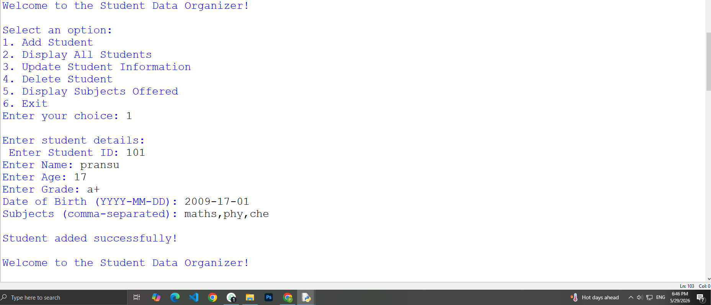
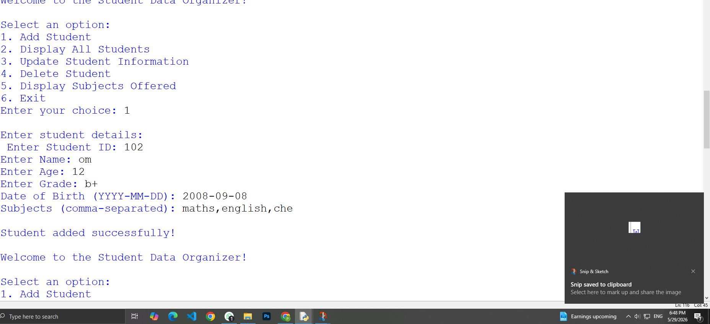
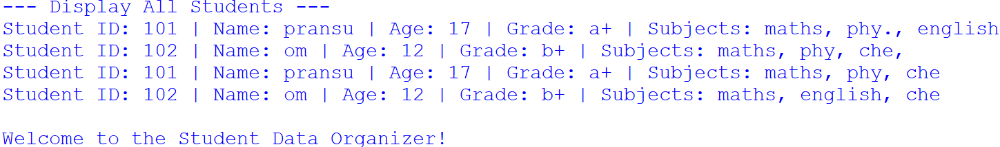
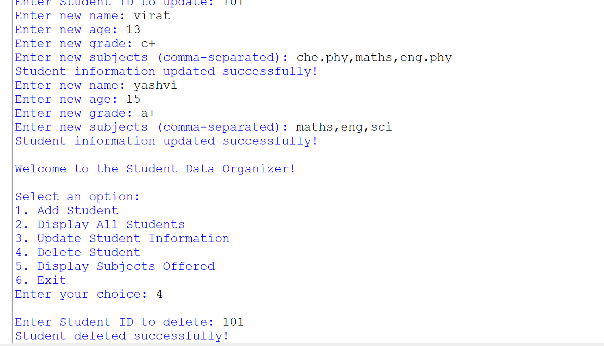
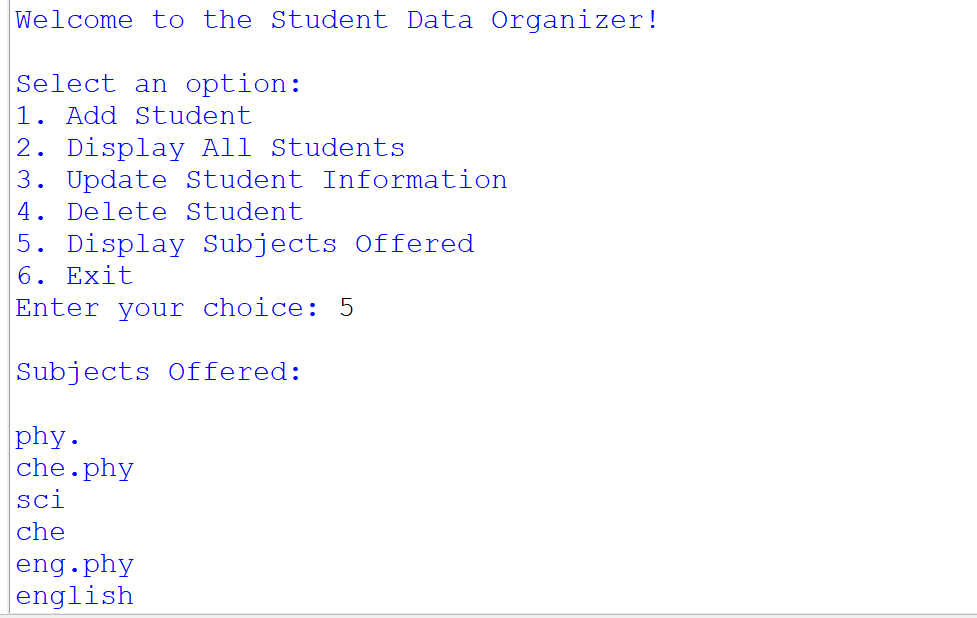
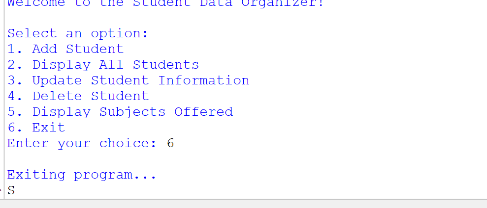

# 🎓 Student Data Organizer

<div align="center">


**A powerful, menu-driven command-line application to manage student records effortlessly.**

</div>

---

## 📋 Table of Contents

- [✨ Features](#-features)
- [🚀 Getting Started](#-getting-started)
- [🎮 Usage](#-usage)
- [📸 Screenshots](#-screenshots)
- [🏗️ Data Structure](#️-data-structure)
- [🛠️ Technologies Used](#️-technologies-used)
- [📂 Project Structure](#-project-structure)

---

## ✨ Features

| Feature | Description |
|---|---|
| ➕ **Add Student** | Register new students with full details |
| 📋 **Display All Students** | View complete list of enrolled students |
| ✏️ **Update Student Info** | Modify existing student records |
| 🗑️ **Delete Student** | Remove student records by ID |
| 📚 **Display Subjects** | View all unique subjects offered |
| 🔒 **Unique Subject Tracking** | Automatically tracks subjects using a `set` |

---

## 🚀 Getting Started

### Prerequisites

- Python **3.10+** (uses `match-case` syntax)

### Installation

```bash
# Clone the repository
git clone https://github.com/yourusername/student-data-organizer.git

# Navigate to the project directory
cd student-data-organizer

# Run the program
python project_3.py
```

---

## 🎮 Usage

When you run the program, you'll be greeted with this menu:

```
Welcome to the Student Data Organizer!

Select an option:
1. Add Student
2. Display All Students
3. Update Student Information
4. Delete Student
5. Display Subjects Offered
6. Exit
Enter your choice:
```

### 📝 Adding a Student

Enter the following details when prompted:

- 🆔 **Student ID** — Unique numeric identifier
- 👤 **Name** — Full name of the student
- 🎂 **Age** — Student's age
- 🏅 **Grade** — Academic grade (e.g., `a+`, `b+`)
- 📅 **Date of Birth** — Format: `YYYY-MM-DD`
- 📚 **Subjects** — Comma-separated list (e.g., `maths, phy, che`)

---

## 📸 Screenshots

### ➕ Adding Students

> **Student 1** — Adding Pransu (ID: 101)



> **Student 2** — Adding Om (ID: 102)



---

### 📋 Displaying All Students

> All registered student records displayed in a clean table format.



---

### ✏️ Updating Student Information

> Updating student records with new name, age, grade, and subjects.



---

### 🗑️ Deleting a Student

> Successfully deleting a student by their unique ID.


---

### 📚 Subjects Offered

> View all unique subjects collected across all students.



---

### 🚪 Exiting the Program



---

## 🏗️ Data Structure

The program uses a combination of Python data structures:

```python
# Student stored as a dictionary
student = {
    "id":       101,           # int (from tuple)
    "dob":      "2009-17-01",  # str (from tuple)
    "name":     "pransu",      # str
    "age":      17,            # int
    "grade":    "a+",          # str
    "subjects": ["maths", "phy", "che"]  # list
}

students = []        # list of student dicts
all_subjects = set() # set for unique subjects
```

### Why These Data Structures?

| Structure | Usage | Why? |
|---|---|---|
| `dict` | Per-student record | Fast key-based access |
| `list` | Collection of students | Ordered, mutable |
| `tuple` | `(student_id, dob)` | Immutable pairing |
| `set` | All unique subjects | Auto-deduplication |

---

## 🛠️ Technologies Used

- 🐍 **Python 3.12** — Core language
- 🔀 **match-case** — Python 3.10+ structural pattern matching
- 📦 **Built-in only** — No external dependencies required

---

## 📂 Project Structure

```
student-data-organizer/
│
├── 📄 project_3.py      # Main application file
├── 📄 README.md         # Project documentation
└── 🖼️  screenshots/     # Output screenshots
    ├── 1.png
    ├── 2.png
    ├── 3.png
    ├── 4.png
    ├── 5.png
    ├── 6.png
    └── 7.png
```

---

## 🧠 Key Concepts Demonstrated

- ✅ **Lists** — Dynamic student roster
- ✅ **Dictionaries** — Structured student records
- ✅ **Tuples** — Immutable `(id, dob)` pairing
- ✅ **Sets** — Unique subject collection
- ✅ **match-case** — Clean multi-branch control flow
- ✅ **CRUD Operations** — Create, Read, Update, Delete
- ✅ **Input Validation** — `not found` handling for IDs

---

<div align="center">
pranshu patel
</div>
